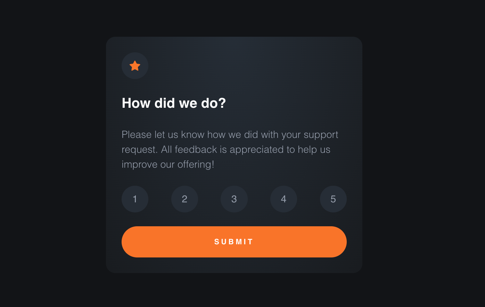

# Frontend Mentor - Interactive rating component solution

This is a solution to the [Interactive rating component challenge on Frontend Mentor](https://www.frontendmentor.io/challenges/interactive-rating-component-koxpeBUmI).

## Table of contents

- [Overview](#overview)
  - [The challenge](#the-challenge)
  - [Screenshot](#screenshot)
  - [Links](#links)
- [My process](#my-process)
  - [Built with](#built-with)
  - [What I learned](#what-i-learned)
  - [Continued development](#continued-development)
  - [Useful resources](#useful-resources)
- [Author](#author)
- [Acknowledgments](#acknowledgments)

## Overview

### The challenge

Users should be able to:

- View the optimal layout for the app depending on their device's screen size
- See hover states for all interactive elements on the page
- Select and submit a number rating
- See the "Thank you" card state after submitting a rating

### Screenshot



### Links

- Solution URL: [Add solution URL here](https://your-solution-url.com)
- Live Site URL: [Add live site URL here](https://your-live-site-url.com)

## My process

### Built with

- Semantic HTML5 markup
- SCSS
- Flexbox
- Mobile-first workflow
- Typescript
- [Vitest](https://vitest.dev/) - TDD
- [React Testing Library](https://testing-library.com/) - TDD
- [React](https://reactjs.org/) - JS library
- [Vite](https://vitejs.dev/) - Dev Environment
- [Figma](https://www.figma.com/) - For dimension

### What I learned

Used TDD to guide development in order to test features, provide predictable results, and have confidence in the code

To run locally

```bash
git clone
cd
npm install
npm run dev
```

### Continued development

In order to improve user interaction, I wanted to incorporate 3D capabilities into the program. Three might make a fantastic candidate.

### Useful resources

- [Test-Driven Development in React](https://www.youtube.com/playlist?list=PLXXnezSEtvNMlfJFd1Z2wilxymcOaVl9Q) - Great resource to learn TDD.

## Author

- LinkedIn - [Natnael Kagnaw](https://www.linkedin.com/in/natnael-kagnaw/)
- Frontend Mentor - [@NatnaelSisay](https://www.frontendmentor.io/profile/NatnaelSisay)

## Acknowledgments

- [Josh Justice](https://twitter.com/CodingItWrong) - for the best TDD resource
